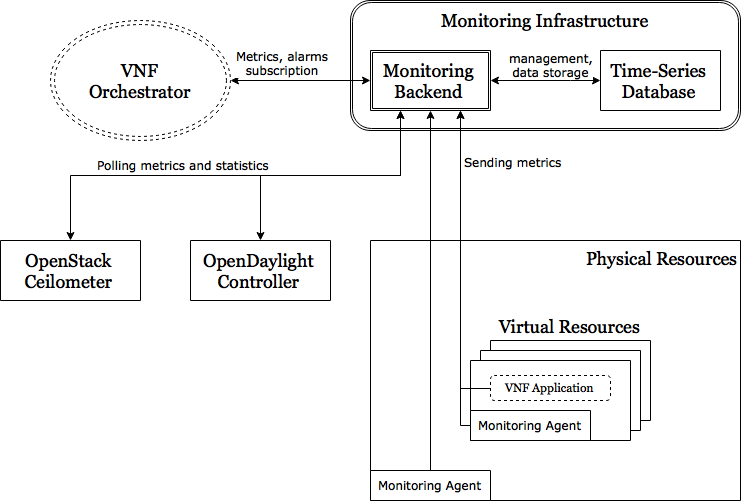

# The T-NOVA VIM Monitoring Framework

## Architecture and Functional Entities

The overall architecture of the T-NOVA VIM monitoring framework can be defined
by taking into account the technical requirements, as well as the technical
choices made for the NFVI and VIM infrastructure. The specification phase has
concluded that the OpenStack platform will be used for the control of the
virtualised IT infrastructure, as well as the OpenDayLight controller for the
management of the SDN network elements. In this context, it is proper to
leverage the OpenDayLight (Statistics API) and OpenStack (Telemetry API)
capabilities for collecting metrics, rather than directly polling the network
elements and the hypervisors at NFVI layer, respectively.

Theoretically, it would be possible for the Orchestrator to directly poll the
cloud and network controllers of each NFVI-PoP and retrieve resource metrics
respectively. This approach, although simple and straightforward, would
completely fail to address the challenges outlined in Section 6.3 and in
particularly would introduce significant scalability issues on the Orchestrator
side.

Thus, it seems appropriate to introduce a mediator/processing entity at the VIM
level to collect, consolidate, process metrics and communicate them to the
Orchestrator. We call this entity VIM Monitoring Manager (VIM MM), as a
stand-alone software component.

OpenStack and OpenDayLight already provide a rich set of metrics for both
physical and virtual nodes, which should be sufficient for most T-NOVA
requirements. However, in order to gain a more detailed insight on the VNF
status and operation, it would be advisable to be able to connect a rich set of
metrics from the guest OS of the VNF container, including information which
cannot be obtained via the hypervisor. This enhanced monitoring capability is
expected (yet still needs to be assessed) to significantly augment the
effectiveness of the VIM MM with regard to status awareness and proactive fault
detection.

For this purpose, it is decided to introduce an additional optional entity
deployed within the VNF container, namely the VNF Monitoring Agent (VNF MA).
The latter will be optionally pre-packaged within the VNF image and will
provide enhanced VNF monitoring capabilities. The monitoring agent will collect
generic information about guest OS status, processes and resources, rather than
VNF-specific information. The latter will be directly communicated by the VNF
application itself to the VNF Manager.

Based on the need outlined above, the architecture of the VIM monitoring
framework can be defined as follows:

The monitoring infrastructure is composed of the backend and a database
dedicated to store the various metrics. Due to the nature of the stored data
and the type of queries the monitoring backend will have to make, a time-series
database is required.

Metrics collection is being performed in three different ways: (a) The backend
aggregates metrics by polling the cloud (OpenStack) and network (OpenDayLight)
controllers and stores them to the database, (b) VNF MAs upload generic metrics
directly to the time-series database and (c) VNF-specific applications upload
directly measurements to the time-series database.

The backend consolidates all those metrics, produces events/alarms if
appropriate and communicates them to the Orchestrator. For the sake of
scalability and efficiency, it was decided that metrics will be pushed by the
backend to the Orchestrator, rather than being polled by the latter. Moreover,
the process of metrics collection/communication and event generation can be
partially configured by the Orchestrator via a relevant configuration service
to be exposed by VIM MM.

## Monitoring Agents and Integration with VNFs

VNFs use both a specific agent and an HTTP API to communicate with the VIM MM
for monitoring purposes.

[collectd](https://collectd.org/), the system statistics collection daemon, has
been selected, mainly because of its availability in mainstream Linux
distributions. The metrics that are generated are pushed at fixed intervals to
the time-series database which acts as a collectd server. For the time being,
this workflow is sufficient, but as integration proceeds as intended, the
backend might need to take a more active role in receiving those metrics and
matching them to OpenStack instances.

An HTTP API is also provided by the time-series database selected in T-NOVA.
VNF-specific applications are allowed to use this in order to add specific
measurements in the database. A wrapper library developed in Python has already
been circulated among VNF developers to facilitate with this API and will be
publicly available soon. Again, although there are no issues reported with this
functionality, this might need to change in the future in order to support a
proper way of matching the metrics to OpenStack instances.

## VIM Monitoring Manager Components

### Monitoring backend

The backend is the core component of the monitoring framework. It is developed
in JavaScript and uses the [node.js](https://nodejs.org/) to run as a
server-side application. JavaScript matches an asynchronous, event-driven
programming style, optimal for building scalable network applications. The main
functionality of VIM MM is data communication and the node.js ecosystem offers
several services to facilitate communication, especially via web services, as
well as event-driven networking.

The backend itself is divided to the following modules:

* **Database connector** This module accesses the time-series database
  in order to write and to read measurements. This module uses heavily
  [influent](https://github.com/gobwas/influent), an InfluxDB Javascript
  driver.

* **OpenStack** This module performs requests to various OpenStack
  modules in order to acquire OpenStack-related metrics. It communicates with
  Keystone, the OpenStack Identity service, in order to generate tokens that
  can be used for authentication and authorisation during the rest of the
  OpenStack queries. It polls Nova, the OpenStack Compute service, in order to
  get the available instances. Finally, it polls Ceilometer, the OpenStack
  Telemetry service, in order to receive the latest measurements of the
  instances. The
  [request-promise](https://www.npmjs.com/package/request-promise) npm module
  provides here the HTTP client to perform all these requests.

* **HTTP REST API** This module exposes all the recorded measurements
  via HTTP and offers the ability to subscribe to specific measurement events.
  [hapi.js](http://hapijs.com/) has been extensively used as a framework to
  build this. hapi.js plugins were also used, such as
  [joi](https://github.com/hapijs/joi) for validation,
  [hapi-swaggered](https://github.com/z0mt3c/hapi-swaggered) and
  [hapi-swagger](https://github.com/glennjones/hapi-swagger) for Swagger
  documentation generation.

* **Configuration** This module allows the use of local files in order to load
  settings. [Node-config](https://github.com/lorenwest/node-config) has been
  used here to define a set of default parameters and extend them for different
  deployment environments, e.g., development, QA, staging and production.
  Configurations are stored in configuration files within the backend
  application and can be overridden and extended by environment variables.

  The default file is called *config/default.json* and user may create multiple
  files in the config directory with the same format, which can later be used
  by the backend application if the environment variable *NODE_ENV* is set to
  the configuration file without the .json suffix, e.g. for
  config/production.json the following command needs to be invoked on a
  Bash-compatible shell:

    export NODE_ENV=production

  The configuration parameters that are currently available are the following:

| Parameter    | Description 	|
| ------------ | -------------	|
| loggingLevel | Sets the logging level. Available levels are debug, warn and info. |
| database     | Connection information for the time-series database. Required information should be entered in the following strings: *host*, *port*, *username*, *password* and *name* (for the target database name). |
| identity     | Connection information for the OpenStack Keystone service. Required information should be entered in the following strings: *host*, *port*, *tenantName*, *username* and *password*. It should be noted that the tenant whose credentials must have sufficient privileges to access all the necessary OpenStack VNF instances. |
| ceilometer   | Connection information for the OpenStack Ceilometer service. Required information should be entered in the following strings: *pollingInterval*, *host* and *port*. The *pollingInterval* sets the time period during which the backend polls Ceilometer for measurements. |
| nova         | Connection information for the OpenStack Nova service. Required information should be entered in the following strings: *host* and *port*. |

### Time-series Database

Since the T-NOVA VIM Monitoring Backend handles primarily measurements, we
think that the use of a time-series database is optimal. For its implementation
we have opted to use InfluxDB, a time-series database written in Go. Although,
InfluxDB is a distributed database, for the time being we are evaluating it on
a single node until storage issues appear.

The Backend requires that a database has already been created in InfluxDB. The
use of a retention policy is also highly recommended, since the database could
store potentially multiple gigabytes of measurement data every day. For the
development and QA testing of the backend we use a retention policy of 30 days.
After 30 days the measurements get erased, so that disk and memory space free
up.

Each measurement is stored in a separate table, where multiple instances may
store values of the specific measurement type. Besides the actual value, a
timestamp and an instance tag are also stored, in order to identify the
measurement's origin and time.

Queries are performed in the [Line
protocol](https://influxdb.com/docs/v0.9/write_protocols/write_syntax.html) by
using the influent module. An example query is the following:

    SELECT last(value) FROM measurementType WHERE host='instanceA'

This query retrieves the last measurement of a certain type and a certain VNF
instance.

### Interfaces to cloud and network controllers

An interface connecting OpenStack with the VIM monitoring backend has been
fully developed. Another one is planned soon for the OpenDaylight.

The current version of the OpenStack connector has the following workflow:

* **Token management** Communication with the OpenStack API requires always a
  valid token. The backend has always a token at its disposal, which is being
  checked before submitting any request and if it is expired, it gets renewed.

* **Instance information retrieval** The backend does not know a priori which
  instances are to be monitored. By posting a request at the Nova API, it gets
  a list of the active instances in order to proceed with the measurement
  request.

* **Measurement retrieval** Once the backend knows the existence of an active
  OpenStack instance, it is able to retrieve specific measurements for it.
  Currently CPU utilisation, incoming and outgoing bytes rate are supported,
  but the list is quickly expanded with other metrics that OpenStack Ceilometer
  supports.

This workflow is being performed with a time period that can be set with the
*pollingInterval* parameter as aforementioned.

### Northbound API to Orchestrator

The VIM Monitoring Framework offers a Northbound API to the Orchestrator in
order to inform the latter of the newest measurements and in the future for
possible alerts. An HTTP RESTful interface provides the latest measurements
upon requests and the ability to subscribe to measurements.

A set of GET endpoints support the transmission of the latest measurements of
every available type for every instance being monitored.

The template of such URL is **/api/measurements/*{instance}*.*{type}***, where
*instance* is the Universally Unique Identifier (UUID) given by the OpenStack
deployment to the instance and *type* one of the supported measurement types.
The currently supported measurement types are:

* *cpu_util* (CPU utilisation)
* *cpuidle* (CPU idle usage)
* *fsfree* (free space on the root filesystem)
* *memfree* (free memory space)
* *network_incoming* (the rate of incoming bytes) and
* *network_outgoing* (the rate of outgoing bytes)

The format of the answer is a JSON object whose fields are the following:

* *timestamp*: shows the timestamp the measurement was taken
* *value*: shows the actual measurement value
* *units*: shows the measurement units

These endpoints require constant polling in order to retrieve their values. If
a system requires a constant stream of measurements at specific interval times,
then it could use the subscription endpoint.

In order to subscribe for measurement events, it is required to provide the
following information in the form of a JSON object:

* *types*: This is an array of the measurement types. The supported types are
  the same ones as the ones in the GET endpoints.
* *instances*: This is an array of the instances that have to be monitored. The
  UUIDs of the instances are also used here.
* *interval*: This is the interval time the monitoring backend has to wait
  before sending a new set of measurements. The time should be given in
  minutes.
* callbackUrl: This is the URL the monitoring backend has to callback in order
  to submit the newest measurements.

This JSON object has to be submitted as a payload in a POST request to the
endpoint **/api/subscribe**. Upon transmission, a confirmation message is sent
back as response and after the specified interval, a message is given to the
*callbackUrl*, similar to the ones one can get via the GET endpoints.

For the convenience of API users a Swagger-UI endpoint is given at **/docs**,
where users can refer to for up-to-date information.

### Anomaly detection

The monitoring framework does not currently support anomaly detection, but
preliminary work has been started towards this direction by designing an alert
system. Rules are going to be submitted in the framework which checks the
affected measurements, evaluates the expressions given by the rules and send
eventually a notification if the expression is true. We believe that in a
future step of the framework evolution, it is going to be able to group
"issues" that are closely related as a single "anomaly" and avoid sending
multiple notifications for different measurements / rules.

### Graphical user interface

The main interface of the VIM Monitoring Framework is the HTTP API of the
backend. During the development of the monitoring framework, the VNF developers
have, however, requested for a graphical way of accessing the monitoring data
their VNF instances and VNF applications more specifically, produce. This lead
to the integration of a Grafana server. [Grafana](http://grafana.org/) is a
graph builder for visualising time series metrics. It supports InfluxDB as a
data source and thus, it is easy to visualise all the available measurements
directly from the database.

Additionally for the graphical user interface, we are also planning to release
soon a graphical user interface for the monitoring backend where some of the
parameters will be able to change and the backend logs will be more accessible
to the administrators.

## Open-Source Release, Packaging and Documentation

The T-NOVA Monitoring Manager is being released under the [GNU General Public
License
v3.0](https://github.com/spacehellas/tnova-vim-backend/blob/master/LICENSE.txt).
People and organisations are welcome to download and do pull requests on the
public [GitHub repository](https://github.com/spacehellas/tnova-vim-backend).

The software follows the [Semantic Versioning Scheme](http://semver.org/),
which is defined in short as follows:

Given a version number MAJOR.MINOR.PATCH, increment the:

* MAJOR version when you make incompatible API changes,
* MINOR version when you add functionality in a backwards-compatible manner,
  and
* PATCH version when you make backwards-compatible bug fixes.

A Docker image containing node and the application is also provided inside this
repository. We have opted out creating an npm module, since the VIM monitoring
project is not strongly related with other JavaScript projects. A Docker image
allows the seamless usage of the backend in any OpenStack deployment,
regardless of deploying it on a physical or virtual machine. Most of the
configuration parameters are exposed in Docker environment variables and can be
set up during container creation. A docker-compose.yml is also provided inside
the repository, so that users can combine the VIM monitoring backend, InfluxDB
and Grafana in the way the backend is being developed and tested.

For further documentation of the backend, please refer to the [README
file](https://github.com/spacehellas/tnova-vim-backend/blob/master/README.md)
and the [documentation
directory](https://github.com/spacehellas/tnova-vim/blob/master/documentation)
of the repository. The information there is going to be up-to-date with the
development breakthroughs unless stated otherwise. For the API documentation,
please refer to the /docs endpoint of a working deployment, where the
Swagger-UI is hosted.
